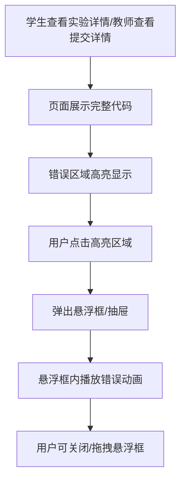
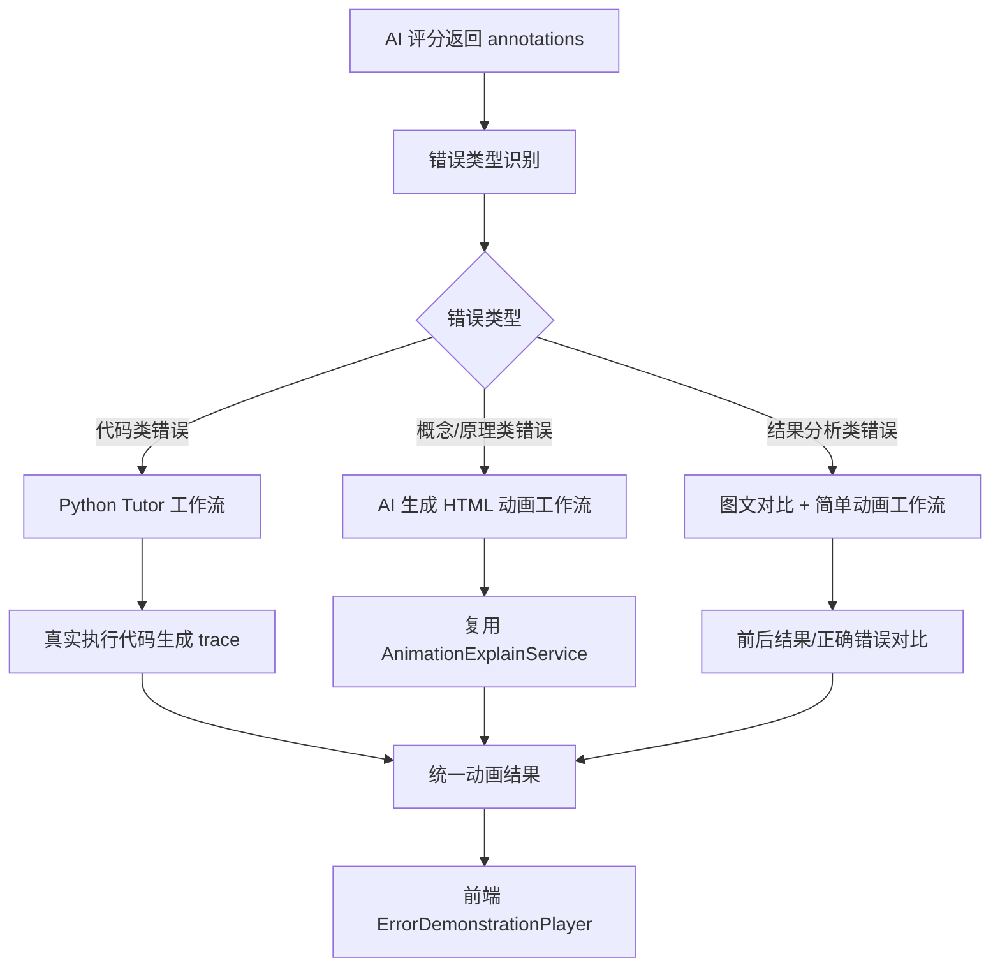
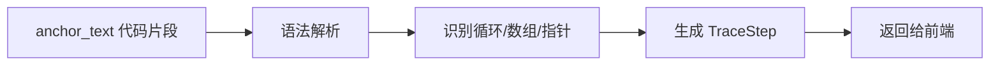

# 错误演示动画基于真实 AI 批注的优化方案

## 1. 背景与问题

### 1.1 现状

当前 `GradingErrorDemonstrationService` 生成错误演示动画的流程是：

1. 从 `ScoreItemEntity.comment` 和 `annotationsJson` 中提取关键词
2. 根据关键词匹配预定义的错误模板（数组越界、未初始化指针、运行时错误）
3. 返回写死的 `TraceStep` 步骤

代码示例：

```java
private ErrorDemonstration buildArrayBounds(ErrorCandidate candidate, int index) {
    String source = normalizeLoop(candidate.anchor());
    String corrected = source.replace("<= n", "< n").replace("<=5", "< 5");
    List<TraceStep> steps = List.of(
        step(1, "初始化循环变量", 1, Map.of("i", "0", "n", "5"), memory(0, false), false),
        step(2, "i = 1，访问第二个数组元素", 2, Map.of("i", "1", "n", "5"), memory(1, false), false),
        // ... 固定步骤，数组永远 5 个元素，值永远 10/20/30/40/50
    );
    return new ErrorDemonstration(...);
}
```

### 1.2 问题

| 问题 | 说明 |
|------|------|
| 纯模板/mock | 动画步骤完全写死，和学生实际代码无关 |
| 参数固定 | 数组大小永远 5，循环边界永远 `i <= n` |
| 行号不准 | `activeLine` 固定为 1、2，不是真实代码行 |
| 无题目上下文 | 不知道这段代码属于哪道题、实验要求是什么 |
| 缺少完整代码 | 只展示一段孤立代码，学生难以定位 |
| 交互简单 | 只能按步骤播放，不能点击错误区域查看详情 |
| 覆盖场景少 | 只支持 3 种简单错误类型 |
| 准确性低 | 从评语中关键词匹配，容易误判 |

## 2. 优化目标

将错误演示动画的输入从"关键词模板匹配"改为"基于 AI 真实批注 + 题目上下文 + 完整代码上下文"生成：

1. 使用大模型已经返回的 `annotations` 作为动画来源
2. `anchor_text` 作为错误定位的真实依据
3. 从 `anchor_text` 和证据块 content 中提取真实代码片段
4. 解析真实参数（数组大小、循环边界等）
5. **关联题目上下文**（题目描述、实验要求、测试用例）
6. **提供完整代码视图**，在完整代码中高亮错误区域
7. **支持点击错误区域弹出悬浮框播放动画**

## 3. 整体架构

```mermaid
flowchart LR
    subgraph 后端
        A[AI 评分完成] --> B[ScoreItem.annotations_json]
        B --> C[筛选 CROSS/WAVE 类型批注]
        C --> D[按 evidence_id 关联证据块]
        D --> E[关联题目上下文]
        E --> F[提取完整代码上下文]
        F --> G[解析 anchor_text 中的代码片段]
        G --> H[识别错误模式并提取参数]
        H --> I[生成真实 TraceStep]
        I --> J[返回 ErrorDemonstration]
    end
    
    subgraph 前端
        K[展示完整代码] --> L[标注错误区域]
        L --> M[点击错误区域]
        M --> N[弹出悬浮框]
        N --> O[播放错误动画]
    end
    
    J --> K
```



## 4. 核心设计

### 4.1 题目上下文关联

错误演示不能只看孤立代码，需要知道：

- 这道题的**实验要求**是什么
- 这道题的**预期输入/输出**是什么
- 这道题的**标准解法**是什么
- 学生这段代码在解决什么问题

#### 4.1.1 题目信息来源

| 来源 | 字段 | 说明 |
|------|------|------|
| `grading_task` | `experiment_id` | 关联 legacy experiment，可获取实验描述 |
| `grading_task` | `assignment_offering_id` | 作业Offering，可获取作业要求 |
| `grading_task` | `rubric_id` | 评分维度描述 |
| 学生报告 | 报告正文 | 实验目的、实验内容等 |
| 文件名 | 学号+姓名 | 用于匹配学生 |

#### 4.1.2 题目信息使用方式

```java
public class ProblemContext {
    private final Long experimentId;           // 实验 ID
    private final String experimentTitle;      // 实验标题
    private final String experimentRequirements; // 实验要求
    private final List<TestCase> testCases;    // 测试用例
    private final String expectedOutput;       // 预期输出
    private final String standardSolution;     // 标准解法（可选）
}
```

在生成动画步骤时，题目上下文用于：

1. **生成更自然的解释文案**
   - 例如："在这道'二叉搜索树插入'实验中，你的循环条件导致越界"

2. **提供对比案例**
   - 展示标准解法和当前错误代码的对比

3. **增强错误判断准确性**
   - 结合题目要求判断某个写法是否真的错误

### 4.2 完整代码上下文提取

不要只返回 `anchor_text` 那一小段代码，而是返回包含错误区域的完整代码片段。

#### 4.2.1 提取策略

```java
public class CodeContext {
    private final List<String> fullLines;      // 完整代码行
    private final int anchorStartLine;         // anchor_text 起始行
    private final int anchorEndLine;           // anchor_text 结束行
    private final int highlightStartLine;      // 高亮区域起始行
    private final int highlightEndLine;        // 高亮区域结束行
}
```

提取逻辑：

```java
private CodeContext extractCodeContext(EvidenceBlockEntity block, String anchorText) {
    List<String> lines = block.getContent().lines().collect(Collectors.toList());
    
    // 找到 anchor_text 所在行
    int anchorLine = findLineIndex(lines, anchorText);
    if (anchorLine < 0) {
        // 如果找不到完整匹配，尝试分词匹配
        anchorLine = fuzzyFindLineIndex(lines, anchorText);
    }
    
    // 扩展上下文：前后各 5 行
    int contextStart = Math.max(0, anchorLine - 5);
    int contextEnd = Math.min(lines.size() - 1, anchorLine + 5);
    
    // 如果证据块本身就是完整函数，直接返回
    if (isCompleteFunction(block.getContent())) {
        contextStart = 0;
        contextEnd = lines.size() - 1;
    }
    
    return new CodeContext(
        lines.subList(contextStart, contextEnd + 1),
        anchorLine,
        anchorLine,
        contextStart,
        contextEnd
    );
}
```

#### 4.2.2 识别代码边界

为了展示完整代码而不是一段孤立代码，需要识别代码边界：

```java
private static final Pattern FUNCTION_START = 
    Pattern.compile("^\\s*(int|void|char|float|double|bool|struct\\s+\\w+)\\s+\\w+\\s*\\(");

private static final Pattern BLOCK_END = 
    Pattern.compile("^\\s*\\}\\s*$");
```

当 anchor_text 位于某个函数内部时，向上找到函数开始，向下找到函数结束，返回整个函数代码。

### 4.3 前端悬浮框交互设计

#### 4.3.1 交互流程



#### 4.3.2 悬浮框内容

悬浮框内包含：

1. **错误标题**：如"数组越界：循环终止条件有误"
2. **错误说明**：结合题目上下文的自然语言解释
3. **迷你动画播放器**：
   - 代码高亮
   - 内存/变量状态变化
   - 上一步/下一步/播放控制
4. **正确写法对比**：展示修正后的代码
5. **关联知识点**：链接到相关知识点动画

#### 4.3.3 前端组件结构

```vue
<template>
  <div class="code-viewer">
    <div
      v-for="(line, index) in codeLines"
      :key="index"
      class="code-line"
      :class="{ 'has-error': errorLineIndexes.includes(index) }"
      @click="handleLineClick(index)"
    >
      <span class="line-number">{{ index + 1 }}</span>
      <code>{{ line }}</code>
    </div>
    
    <!-- 悬浮框 -->
    <ErrorDemoFloatPanel
      v-if="activeDemo"
      :demo="activeDemo"
      :position="panelPosition"
      @close="activeDemo = null"
    />
  </div>
</template>
```

### 4.4 基于真实批注的动画生成

#### 4.4.1 输入变更

**当前输入：**

```java
public List<ErrorDemonstration> buildDemonstrations(List<ScoreItemEntity> scoreItems)
```

**优化后输入：**

```java
public List<ErrorDemonstration> buildDemonstrations(
        GradingTaskEntity task,                    // 新增：题目上下文
        List<ScoreItemEntity> scoreItems,
        List<EvidenceBlockEntity> evidenceBlocks
)
```

#### 4.4.2 从 annotations 构建动画候选

```java
private List<AnimationCandidate> collectAnimationCandidates(
        GradingTaskEntity task,
        List<ScoreItemEntity> scoreItems,
        List<EvidenceBlockEntity> evidenceBlocks) {
    
    List<AnimationCandidate> candidates = new ArrayList<>();
    Map<String, EvidenceBlockEntity> evidenceById = evidenceBlocks.stream()
            .collect(Collectors.toMap(EvidenceBlockEntity::getEvidenceId, Function.identity()));

    ProblemContext problemContext = buildProblemContext(task);

    for (ScoreItemEntity item : scoreItems) {
        List<AnnotationDto> annotations = parseAnnotations(item.getAnnotationsJson());
        for (AnnotationDto ann : annotations) {
            if (!"CROSS".equals(ann.type()) && !"WAVE".equals(ann.type())) {
                continue; // 只给错误/警告生成动画
            }
            EvidenceBlockEntity block = evidenceById.get(ann.evidenceId());
            if (block == null || block.getContent() == null) {
                continue;
            }
            CodeContext codeContext = extractCodeContext(block, ann.anchorText());
            candidates.add(new AnimationCandidate(ann, block, codeContext, problemContext));
        }
    }
    return candidates;
}
```

#### 4.4.3 错误模式识别

```java
private ErrorType detectErrorType(String anchorText, String note) {
    String combined = (anchorText + " " + note).toLowerCase(Locale.ROOT);
    if (containsAny(combined, "越界", "out of bounds", "arr[", "i <= n", "访问")) {
        return ErrorType.ARRAY_BOUNDS;
    }
    if (containsAny(combined, "未初始化", "空指针", "null pointer", "野指针", "*temp")) {
        return ErrorType.INVALID_POINTER;
    }
    if (containsAny(combined, "死循环", "无限循环", "while(true)", "循环终止")) {
        return ErrorType.INFINITE_LOOP;
    }
    if (containsAny(combined, "内存泄漏", "malloc", "free", "未释放")) {
        return ErrorType.MEMORY_LEAK;
    }
    if (containsAny(combined, "递归", "recursion", "栈溢出")) {
        return ErrorType.RECURSION;
    }
    return ErrorType.GENERIC_HIGHLIGHT;
}
```

> 注意：这里仍然有关键词判断，但判断对象是 AI 已经定位好的真实错误片段，准确性远高于从整段评语中匹配。

#### 4.4.4 真实参数提取

```java
public class ArrayBoundsParams {
    private final int arraySize;       // 数组实际大小
    private final int loopUpperBound;  // 循环上界（如 n 或 5）
    private final boolean isInclusive; // 是否包含上界（<= 还是 <）
    private final int anchorLineIndex; // anchor_text 在完整代码中的行号
}
```

正则示例：

```java
private static final Pattern ARRAY_SIZE_PATTERN =
    Pattern.compile("arr\\[(\\d+)\\]|大小为(\\d+)|长度是(\\d+)|\\[(\\d+)\\]");

private static final Pattern LOOP_BOUND_PATTERN =
    Pattern.compile("<=\\s*(\\w+)|<\\s*(\\w+)|>=\\s*(\\w+)|>\\s*(\\w+)");

private static final Pattern ARRAY_LITERAL_PATTERN =
    Pattern.compile("\\{\\s*([^}]+)\\s*\\}");
```

#### 4.4.5 生成真实动画步骤

```java
private ErrorDemonstration buildArrayBounds(AnimationCandidate candidate, int index) {
    ArrayBoundsParams params = extractArrayBoundsParams(candidate);
    String anchor = candidate.annotation().anchorText();
    String corrected = buildCorrectedLoop(anchor, params.isInclusive());
    CodeContext codeContext = candidate.codeContext();
    ProblemContext problem = candidate.problemContext();

    List<TraceStep> steps = new ArrayList<>();
    int arraySize = params.arraySize();
    int upperBound = params.loopUpperBound();

    // 正常访问步骤
    for (int i = 0; i < arraySize; i++) {
        steps.add(new TraceStep(
            i + 1,
            "i = " + i + "，访问 arr[" + i + "]",
            params.anchorLineIndex() + 1,
            Map.of("i", String.valueOf(i), "n", String.valueOf(arraySize)),
            buildMemoryCells(arraySize, i, false),
            false
        ));
    }

    // 越界步骤
    if (params.isInclusive() && upperBound >= arraySize) {
        steps.add(new TraceStep(
            arraySize + 1,
            "条件 i <= " + upperBound + " 仍成立，访问 arr[" + arraySize + "] 导致越界",
            params.anchorLineIndex() + 1,
            Map.of("i", String.valueOf(arraySize), "n", String.valueOf(arraySize)),
            buildMemoryCells(arraySize, arraySize, true),
            true
        ));
    }

    return new ErrorDemonstration(
        "error-" + index,
        "ARRAY_BOUNDS",
        "数组越界：循环终止条件有误",
        buildExplanation(candidate, problem),  // 结合题目上下文生成解释
        anchor,
        corrected,
        params.anchorLineIndex() + 1,
        steps,
        codeContext.fullLines(),
        codeContext.highlightStartLine(),
        codeContext.highlightEndLine()
    );
}
```

## 5. 动画渲染技术方案

### 5.1 方案对比

针对错误演示动画的渲染，有三种主流方案：

| 方案 | 原理 | 优点 | 缺点 | 适用场景 |
|------|------|------|------|---------|
| **Python Tutor 类** | 真实执行代码，捕获每一步的内存/变量状态 | 最真实，可展示任意复杂数据结构 | 技术复杂，需要代码沙箱，安全风险高 | 通用教学平台、算法题库 |
| **HTML/CSS/Vue 组件动画** | 用 Vue 组件 + CSS 过渡按 steps 数据渲染 | 轻量，可控，与现有技术栈一致 | 复杂数据结构表现力有限 | 简单数组、链表、变量演示 |
| **SVG/Canvas 动画** | 用 SVG 或 Canvas 绘制数据结构 | 灵活，适合树、图、链表等复杂结构 | 开发成本高 | 树、图、复杂数据结构 |
| **Trace 数据驱动 + 多渲染器** | 后端统一生成 trace，前端根据数据结构类型选择渲染器 | 兼顾简单和复杂场景，可扩展 | 架构设计复杂 | 中大型教学系统 |

### 5.2 推荐方案：错误类型驱动的混合工作流

结合项目现状与需求，推荐采用 **"错误类型识别 + 三套工作流路由"** 的混合架构。



### 5.3 错误类型识别与路由

#### 5.3.1 错误分类标准

根据 `anchor_text`、`note`、`evidence kind` 和 `problemContext` 判断错误类型：

| 错误类型 | 判断依据 | 路由工作流 |
|---------|---------|-----------|
| **代码类错误** | `anchor_text` 包含代码片段，且错误与执行过程相关 | Python Tutor 工作流 |
| **概念/原理类错误** | `anchor_text` 是文字描述，错误涉及概念理解 | AI 生成 HTML 动画工作流 |
| **结果分析类错误** | 错误与输出结果、图表、实验数据相关 | 图文对比 + 简单动画工作流 |
| **无法归类** | 无法明确分类 | 通用高亮工作流 |

#### 5.3.2 路由逻辑

```java
public enum AnimationWorkflow {
    PYTHON_TUTOR,      // 代码类错误
    HTML_ANIMATION,    // 概念/原理类错误
    IMAGE_TEXT_COMPARE,// 结果分析类错误
    GENERIC_HIGHLIGHT  // 兜底
}

public AnimationWorkflow route(AnimationCandidate candidate) {
    String anchor = candidate.annotation().anchorText();
    String note = candidate.annotation().note();
    String kind = candidate.evidenceBlock().getKind();
    
    // 代码类：包含代码关键字或证据块是代码截图
    if (looksLikeCode(anchor) || "ocr".equals(kind) && containsCodeKeywords(anchor)) {
        return AnimationWorkflow.PYTHON_TUTOR;
    }
    
    // 结果分析类：包含图表、输出、结果等关键词
    if (containsAny(note + anchor, "结果", "输出", "图表", "数据", "对比", "差异")) {
        return AnimationWorkflow.IMAGE_TEXT_COMPARE;
    }
    
    // 概念/原理类：其他文字类错误
    if ("text".equals(kind) || "vlm".equals(kind)) {
        return AnimationWorkflow.HTML_ANIMATION;
    }
    
    return AnimationWorkflow.GENERIC_HIGHLIGHT;
}
```

### 5.4 Python Tutor 工作流（代码类错误）

#### 适用场景

- 数组越界
- 空指针/野指针
- 死循环
- 递归错误
- 内存泄漏
- 栈溢出

#### 实现方式

**方案 A：真实执行（推荐长期）**

后端用安全沙箱执行学生代码片段，捕获每一步状态：

```java
public class PythonTutorRunner {
    public List<TraceStep> execute(String code, String language, List<String> inputs) {
        // 1. 根据语言选择执行器
        Executor executor = createExecutor(language); // C: GDB/WASM, Python: settrace
        
        // 2. 执行并捕获 trace
        List<ExecutionFrame> frames = executor.run(code, inputs);
        
        // 3. 转换为 TraceStep
        return frames.stream()
            .map(this::toTraceStep)
            .collect(Collectors.toList());
    }
}
```

**方案 B：基于 trace 模板的半真实执行（短期落地）**

如果真实执行成本高，可以：
1. 从 `anchor_text` 提取代码片段
2. 用预定义的错误模式生成 trace
3. 但 trace 参数从真实代码中提取（数组大小、循环边界等）



#### Trace 数据格式

```json
{
  "workflow": "python_tutor",
  "dataStructure": "array",
  "title": "数组越界演示",
  "sourceCode": "int arr[5];\nfor (int i = 0; i <= 5; i++) { ... }",
  "steps": [
    {
      "order": 1,
      "line": 2,
      "explanation": "i = 0，访问 arr[0]",
      "variables": { "i": "0" },
      "state": {
        "array": [
          { "index": 0, "value": "?", "active": true, "outOfBounds": false },
          { "index": 1, "value": "?", "active": false, "outOfBounds": false }
        ]
      },
      "error": false
    }
  ]
}
```

#### 前端渲染

- 左侧：代码高亮 + 当前执行行
- 右侧：内存可视化（数组/链表/树/图）
- 底部：变量状态 + 步骤控制

### 5.5 AI 生成 HTML 动画工作流（概念/原理类错误）

#### 适用场景

- "未理解递归原理"
- "指针概念混淆"
- "时间复杂度分析错误"
- "算法选择不当"

#### 复用 AnimationExplainService

项目已有 `AnimationExplainService`，它可以根据知识点主题生成 HTML 动画。

复用方式：

```java
public class ConceptAnimationWorkflow {
    private final AnimationExplainService animationExplainService;
    
    public AnimationResult generate(AnimationCandidate candidate) {
        // 1. 构造主题
        String topic = buildTopic(candidate);
        // 例如："解释数组越界原理"、"递归调用过程"
        
        // 2. 调用现有服务生成 HTML 动画
        Long explainId = animationExplainService.create(
            teacherId, topic, "cyber-clean"
        ).get("id") as Long;
        
        // 3. 等待生成完成，获取 HTML 内容
        AnimationExplainEntity entity = waitForCompletion(explainId);
        
        // 4. 包装为 AnimationResult
        return new AnimationResult(
            "html_animation",
            topic,
            entity.getFrames(),
            null  // 无 trace
        );
    }
}
```

#### 主题构造示例

```java
private String buildTopic(AnimationCandidate candidate) {
    String note = candidate.annotation().note();
    String problemTitle = candidate.problemContext().experimentTitle();
    
    if (containsAny(note, "递归")) {
        return problemTitle + "：递归执行过程与常见错误";
    }
    if (containsAny(note, "指针")) {
        return problemTitle + "：指针与内存地址的关系";
    }
    if (containsAny(note, "时间复杂度")) {
        return problemTitle + "：时间复杂度分析";
    }
    return problemTitle + "：" + note;
}
```

#### 返回数据格式

```json
{
  "workflow": "html_animation",
  "title": "递归执行过程与常见错误",
  "frames": [
    {
      "index": 1,
      "title": "递归基本情况",
      "narration": "递归需要两个要素...",
      "htmlUrl": "https://minio/animations/frame_1.html"
    }
  ]
}
```

#### 前端渲染

- 使用 iframe 加载 HTML 动画
- 提供播放/暂停/上一步/下一步控制
- 字幕层显示 narration

### 5.6 图文对比 + 简单动画工作流（结果分析类错误）

#### 适用场景

- 实验结果与预期不符
- 输出数据错误
- 图表绘制错误
- 测试用例未通过

#### 实现方式

```java
public class ResultCompareWorkflow {
    public AnimationResult generate(AnimationCandidate candidate, ProblemContext problem) {
        // 1. 获取预期结果
        String expectedOutput = problem.getExpectedOutput();
        
        // 2. 从证据块获取学生实际结果
        String actualOutput = extractActualOutput(candidate);
        
        // 3. 使用 AI 生成差异分析
        String diffExplanation = aiClient.generateDiffExplanation(
            expectedOutput, actualOutput, candidate.annotation().note()
        );
        
        // 4. 构建对比动画数据
        return new AnimationResult(
            "result_compare",
            "结果对比分析",
            List.of(
                CompareFrame.of("预期结果", expectedOutput, "green"),
                CompareFrame.of("实际结果", actualOutput, "red"),
                CompareFrame.of("差异分析", diffExplanation, "blue")
            ),
            null
        );
    }
}
```

#### 返回数据格式

```json
{
  "workflow": "result_compare",
  "title": "输出结果对比",
  "frames": [
    {
      "order": 1,
      "type": "expected",
      "label": "预期输出",
      "content": "10\n20\n30",
      "highlightLines": []
    },
    {
      "order": 2,
      "type": "actual",
      "label": "实际输出",
      "content": "10\n20\n30\n越界访问",
      "highlightLines": [3]
    },
    {
      "order": 3,
      "type": "diff",
      "label": "差异分析",
      "content": "第4行出现了越界访问，说明循环边界有误"
    }
  ]
}
```

#### 前端渲染

- 左右分栏：预期 vs 实际
- 差异行高亮
- 简单过渡动画
- 文字说明卡片

### 5.7 统一返回数据结构

无论走哪个工作流，最终都返回统一的 `AnimationResult`：

```java
public record AnimationResult(
    String workflow,           // python_tutor / html_animation / result_compare / generic
    String title,
    String explanation,
    List<?> frames,            // 具体类型取决于 workflow
    Object metadata            // 额外元数据
) {}
```

前端根据 `workflow` 字段选择渲染组件：

```vue
<template>
  <div class="animation-container">
    <PythonTutorPlayer v-if="result.workflow === 'python_tutor'" :data="result" />
    <HtmlAnimationPlayer v-else-if="result.workflow === 'html_animation'" :data="result" />
    <ResultComparePlayer v-else-if="result.workflow === 'result_compare'" :data="result" />
    <GenericHighlightPlayer v-else :data="result" />
  </div>
</template>
```

### 5.8 工作流选择总结

| 工作流 | 适用错误 | 技术方案 | 复用现有能力 |
|--------|---------|---------|-------------|
| **Python Tutor** | 代码执行类错误 | 真实执行/半真实执行 + trace | `ErrorDemonstrationPlayer.vue` |
| **HTML 动画** | 概念/原理类错误 | AI 生成 HTML 动画 | `AnimationExplainService` |
| **图文对比** | 结果/数据类错误 | 对比 + 简单动画 | 新开发，复用证据块展示 |
| **通用高亮** | 无法归类 | anchor_text 高亮 | 现有组件 |

### 5.9 与现有组件的关系

- `ErrorDemonstrationPlayer.vue`：改造为通用容器，根据 `workflow` 加载不同子播放器
- `AnimationExplainService`：被 HTML 动画工作流复用
- `SubmissionReview.vue` / `ExperimentDetail.vue`：接入新的统一播放器
- 新增工作流时，只需新增一个子播放器组件，不影响整体框架


## 6. 数据结构

### 6.1 后端 Java

```java
public record AnimationCandidate(
    AnnotationDto annotation,
    EvidenceBlockEntity evidenceBlock,
    CodeContext codeContext,
    ProblemContext problemContext
) {}

public record CodeContext(
    List<String> fullLines,
    int anchorStartLine,
    int anchorEndLine,
    int highlightStartLine,
    int highlightEndLine
) {}

public record ProblemContext(
    Long experimentId,
    String experimentTitle,
    String experimentRequirements,
    List<TestCase> testCases,
    String standardSolution
) {}

public record ArrayBoundsParams(
    int arraySize,
    int loopUpperBound,
    boolean isInclusive,
    int anchorLineIndex
) {}

public enum ErrorType {
    ARRAY_BOUNDS,      // 数组越界
    INVALID_POINTER,   // 未初始化/野指针
    INFINITE_LOOP,     // 死循环
    MEMORY_LEAK,       // 内存泄漏
    RECURSION,         // 递归问题
    GENERIC_HIGHLIGHT  // 通用高亮（无法识别具体模式时）
}
```

### 6.2 前端接收结构

```json
{
  "id": "error-1",
  "errorType": "ARRAY_BOUNDS",
  "title": "数组越界：循环终止条件有误",
  "explanation": "在'数组遍历'这道实验中，你的循环条件 i <= 5 会导致访问 arr[5]，但数组只有 5 个元素（下标 0-4）",
  "sourceCode": [
    "int main() {",
    "    int arr[5] = {10, 20, 30, 40, 50};",
    "    for (int i = 0; i <= 5; i++) {",
    "        printf(\"%d\\n\", arr[i]);",
    "    }",
    "    return 0;",
    "}"
  ],
  "correctedCode": "for (int i = 0; i < 5; i++) {\n    printf(\"%d\\n\", arr[i]);\n}",
  "errorLine": 3,
  "highlightStartLine": 1,
  "highlightEndLine": 5,
  "anchorLineInEvidence": 3,
  "problemContext": {
    "experimentTitle": "数组遍历",
    "experimentRequirements": "编写程序遍历数组并打印每个元素",
    "testCases": [
      {"input": "arr = [10,20,30,40,50]", "expectedOutput": "10\\n20\\n30\\n40\\n50"}
    ]
  },
  "steps": [
    {
      "order": 1,
      "activeLine": 3,
      "variables": {"i": "0", "n": "5"},
      "memory": [
        {"label": "arr[0]", "value": "10", "active": true, "outOfBounds": false},
        {"label": "arr[1]", "value": "20", "active": false, "outOfBounds": false}
      ],
      "explanation": "i = 0，访问 arr[0]"
    }
  ]
}
```

新增字段：
- `sourceCode`：完整代码行数组
- `highlightStartLine` / `highlightEndLine`：高亮区域
- `problemContext`：题目上下文
- `anchorLineInEvidence`：anchor_text 在证据块中的真实行号
- `errorLine` 基于真实代码计算

## 7. 接口变更

### 7.1 `GradingSubmissionService`

当前调用：

```java
result.put("errorDemonstrations", errorDemonstrationService.buildDemonstrations(scores));
```

变更后：

```java
GradingTaskEntity task = submission.getTask();
List<EvidenceBlockEntity> evidenceBlocks = evidenceBlockRepo.findAllBySubmissionId(submissionId);
result.put("errorDemonstrations", 
    errorDemonstrationService.buildDemonstrations(task, scores, evidenceBlocks));
```

### 7.2 `GradingErrorDemonstrationService`

当前签名：

```java
public List<ErrorDemonstration> buildDemonstrations(List<ScoreItemEntity> scoreItems)
```

变更后签名：

```java
public List<ErrorDemonstration> buildDemonstrations(
        GradingTaskEntity task,
        List<ScoreItemEntity> scoreItems,
        List<EvidenceBlockEntity> evidenceBlocks)
```

## 8. 前端组件设计

### 8.1 完整代码展示组件

```vue
<template>
  <div class="code-viewer">
    <div
      v-for="(line, index) in codeLines"
      :key="index"
      class="code-line"
      :class="{ 
        'has-error': errorLineIndexes.includes(index),
        'is-highlighted': index >= highlightStart && index <= highlightEnd
      }"
      @click="handleLineClick(index)"
    >
      <span class="line-number">{{ index + 1 }}</span>
      <code>{{ line }}</code>
      <span v-if="errorLineIndexes.includes(index)" class="error-badge">〰</span>
    </div>
    
    <ErrorDemoFloatPanel
      v-if="activeDemo"
      :demo="activeDemo"
      :position="panelPosition"
      @close="activeDemo = null"
    />
  </div>
</template>
```

### 8.2 悬浮框动画组件

```vue
<template>
  <div class="error-demo-float" :style="floatStyle">
    <header class="float-header">
      <span class="title">{{ demo.title }}</span>
      <button @click="$emit('close')">×</button>
    </header>
    
    <div class="float-body">
      <p class="explanation">{{ demo.explanation }}</p>
      
      <!-- 迷你动画播放器 -->
      <ErrorDemonstrationPlayer
        :demonstrations="[demo]"
        :readonly="true"
        :compact="true"
      />
      
      <!-- 正确写法对比 -->
      <div class="corrected-code">
        <div class="label">修正后：</div>
        <pre><code>{{ demo.correctedCode }}</code></pre>
      </div>
    </div>
  </div>
</template>
```

### 8.3 交互说明

1. 页面加载时展示完整代码，错误行用红色/波浪线标注
2. 鼠标悬停错误行时显示简略提示
3. 点击错误行弹出悬浮框
4. 悬浮框内自动播放动画
5. 悬浮框可拖拽、可关闭
6. 多个错误时，悬浮框显示"上一个/下一个"切换

## 9. 实现步骤

### 步骤 1：题目上下文模块

- 新增 `ProblemContextResolver`
- 从 `GradingTaskEntity.experimentId` 读取实验信息
- 从评分维度构建实验要求摘要

### 步骤 2：完整代码上下文提取

- 新增 `CodeContextExtractor`
- 实现 anchor_text 定位、代码边界识别、上下文扩展

### 步骤 3：参数提取增强

- 扩展 `ErrorParameterExtractor`
- 支持从完整代码上下文中提取数组大小、循环边界等

### 步骤 4：重构 `GradingErrorDemonstrationService`

- 修改 `buildDemonstrations` 签名
- 新增 `AnimationCandidate`、`CodeContext`、`ProblemContext`
- 修改 `build` 方法，基于完整上下文生成动画

### 步骤 5：扩展 ErrorDemonstration 数据结构

- 新增 `fullSourceCode`、`highlightStartLine`、`highlightEndLine`、`problemContext` 字段

### 步骤 6：前端组件开发

- 开发 `CodeViewer` 组件（完整代码 + 错误标注）
- 开发 `ErrorDemoFloatPanel` 组件（悬浮框动画播放器）
- 在 `SubmissionReview.vue` 和 `ExperimentDetail.vue` 中接入

### 步骤 7：补充单元测试

- 测试题目上下文解析
- 测试代码上下文提取
- 测试参数提取正则
- 测试各种 anchor_text 场景

### 步骤 8：动画渲染器开发

- 实现 `ArrayRenderer`、`LinkedListRenderer` 等 Vue 组件
- 引入 D3.js，实现 `TreeRenderer`、`GraphRenderer` SVG 渲染器
- 在 `ErrorDemonstrationPlayer.vue` 中根据 `dataStructure` 动态选择渲染器

### 步骤 9：集成测试与灰度发布

- 端到端测试：上传 PDF → AI 批改 → 生成动画 → 前端悬浮框播放
- 灰度发布给部分班级，收集反馈
- 逐步扩展支持的错误类型和数据结构

## 10. 预期效果

| 方面 | 优化前 | 优化后 |
|------|--------|--------|
| 数据来源 | 从评语关键词猜 | 从 AI 真实批注取 |
| 题目上下文 | 无 | 有实验标题、要求、测试用例 |
| 代码展示 | 孤立一小段 | 完整代码上下文 |
| 定位准确性 | 无真实定位 | `anchor_text` + 真实证据块 |
| 代码片段 | 写死模板 | 学生报告中的真实代码 |
| 参数 | 固定值 | 从代码中提取 |
| 行号 | 固定 1/2 | 真实行号 |
| 交互 | 只能播放 | 点击代码区域弹出悬浮框 |
| 可扩展性 | 3 种错误 | 可新增多种错误模式 |

## 11. 风险与注意事项

### 11.1 风险

1. **anchor_text 不在 evidence content 中**
   - fallback：从 comment 中重新匹配，或生成通用高亮

2. **完整代码边界识别失败**
   - fallback：只展示 anchor_text 前后 5 行

3. **参数提取失败**
   - 使用默认值兜底，保证动画仍然可播放

4. **证据块 content 过长**
   - 只取相关函数或前后 N 行

5. **多语言代码**
   - 优先支持 C 语言，其他语言先用 `GENERIC_HIGHLIGHT`

6. **悬浮框遮挡代码**
   - 支持拖拽、自动调整位置

### 11.2 注意事项

- 保持现有 `ErrorDemonstration` 核心数据结构兼容，避免前端大规模改动
- 新方案应兼容旧数据：如果 annotations 为空，保留现有基于 comment 的兜底逻辑
- 参数提取尽量保守，宁可用默认值也不要解析错误
- 题目上下文应缓存，避免每次查库

## 12. 兼容旧数据的兜底策略

```java
public List<ErrorDemonstration> buildDemonstrations(
        GradingTaskEntity task,
        List<ScoreItemEntity> scoreItems,
        List<EvidenceBlockEntity> evidenceBlocks) {
    
    // 新方案：基于真实 annotations + 题目上下文 + 完整代码
    List<ErrorDemonstration> fromAnnotations = buildFromAnnotations(task, scoreItems, evidenceBlocks);
    if (!fromAnnotations.isEmpty()) {
        return fromAnnotations;
    }
    
    // 旧方案兜底：基于 comment 关键词
    return buildFromComments(scoreItems);
}
```

## 13. 附录：典型 anchor_text 处理示例

| anchor_text | note | 识别类型 | 提取参数 | 题目上下文使用 |
|------------|------|---------|---------|--------------|
| `for (int i = 0; i <= n; i++)` | 数组越界 | ARRAY_BOUNDS | 数组大小从上下文取，上界 n | 实验要求：遍历数组 |
| `for (int i = 0; i <= 5; i++)` | 访问 arr[5] 越界 | ARRAY_BOUNDS | 数组大小 5，上界 5 | 实验要求：打印 5 个元素 |
| `int *temp; *temp = *a;` | 未初始化指针 | INVALID_POINTER | 指针变量 temp | 实验要求：交换两个数 |
| `while (i >= 0)` | 死循环 | INFINITE_LOOP | 循环条件 i >= 0 | 实验要求：递减计数 |
| `malloc(sizeof(int));` | 未 free | MEMORY_LEAK | 分配类型 int | 实验要求：动态内存管理 |

---

## 14. 与已有实施计划的关系

本方案是对 `grading-publication-annotation-animation-implementation-plan.md` 中"错误演示播放器"的进一步深化：

- 已有计划：完成了发布成绩、批注定位、错误演示播放器基础功能
- 本方案：将错误演示从 mock 模板升级为基于真实 AI 批注 + 题目上下文 + 完整代码上下文的智能动画

---

**文档状态：** 设计草案  
**下一步：** 按步骤 1-7 逐步实现，先做题目上下文解析和代码上下文提取，再重构 `GradingErrorDemonstrationService`
